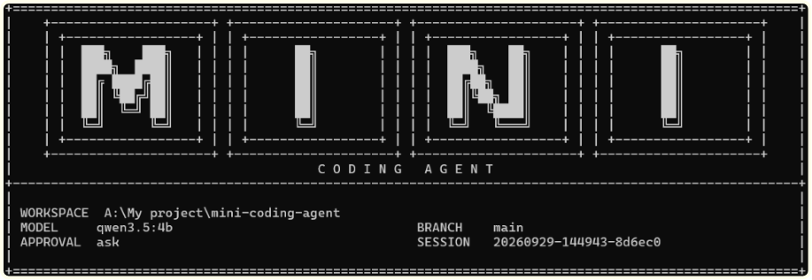

# Mini-Coding-Agent

[](https://www.python.org/)
[](https://ollama.com/)
[](LICENSE)

A lightweight, standalone coding agent written in Python and powered locally by [Ollama](https://ollama.com/).



<br>

Mini-Coding-Agent implements a complete local agent loop: repository context collection, stable prompt composition, schema-checked and permission-gated tool execution, session persistence, context compression, and bounded delegation.

- **Shared core:** [`mini_coding_agent/`](mini_coding_agent/)
- **Compatibility launcher:** [`mini_coding_agent.py`](mini_coding_agent.py)
- **CLI entry point:** `mini-coding-agent`
- **Tutorial:** [Components of a Coding Agent](https://magazine.sebastianraschka.com/p/components-of-a-coding-agent)

The agent is built around six components:

1. **Live repository context:** A refreshable index of the repository, including a filtered file tree, instructions, Git status, diff summary, cache diagnostics, and controlled on-demand file access.
2. **Prompt optimization and cache reuse:** Employs a stable system prefix, separate from dynamic inputs, to enhance local model caching.
3. **Structured tools with validation and permissions:** Executes named, schema-validated tools, restricted by path validation and explicit approval.
4. **Context streamlining and output control:** Reduces redundancy in file reads, limits tool output size, and compresses turn history to manage token usage.
5. **Session persistence and memory:** Saves session history and distilled working memory, enabling session resumption across multiple runs.
6. **Delegated, bounded subagents:** Creates isolated, read-only subagents for specific subtasks, with defined depth limits.

---

The agent persists a versioned, metadata-only context index at `.mini-coding-agent/cache/repository-context-v1.json`. It records filtered paths, file sizes, modification times, hashes, documentation summaries, and Git metadata; it does not cache source-file contents. Use `/context` in the interactive CLI to refresh the index. Successful `write_file` and `patch_file` operations refresh only the affected paths before the next model turn.

### Tools

All tools enforce workspace path containment to prevent directory traversal and symlink escapes.

| Tool | Parameters | Risky | Description |
| --- | --- | :---: | --- |
| `list_files` | `path="."` | No | Lists up to 200 workspace files and directories. |
| `read_file` | `path`, `start=1`, `end=200` | No | Reads lines from a UTF-8 text file, with line numbers. |
| `search` | `pattern`, `path="."` | No | Searches file contents using `ripgrep`, with a standard fallback. |
| `run_shell` | `command`, `timeout=20` | **Yes** | Runs a shell command from the workspace root. |
| `write_file` | `path`, `content` | **Yes** | Creates or overwrites a file, creating parent folders as needed. |
| `patch_file` | `path`, `old_text`, `new_text` | **Yes** | Replaces an exact matching text block in a file. |
| `delegate` | `task`, `max_steps=3` | No | Spawns a read-only subagent to investigate a subtask. |

## Installation

### Requirements

- Python 3.10 or higher (no external runtime dependencies for basic usage)
- Ollama, installed natively or run via Docker
- *(Optional)* [`uv`](https://github.com/astral-sh/uv) for environment and project management

### Clone the repository

```bash
git clone https://github.com/ARUNAGIRINATHAN-K/mini-coding-agent.git
cd mini-coding-agent
```

### Set up Ollama

**Native**

1. Install Ollama from [ollama.com/download](https://ollama.com/download).
2. Start the server and pull the default model:

```bash
ollama serve
ollama pull qwen3.5:4b
```

**Docker**

Use the provided `docker-compose.yml`:

```bash
docker compose up -d ollama
docker compose exec ollama ollama pull qwen3.5:4b
curl http://127.0.0.1:11434/api/tags
```

> **GPU acceleration:** For NVIDIA GPUs, configure the [NVIDIA Container Toolkit](https://github.com/ollama/ollama/blob/main/docs/docker.mdx) on your host.

## Quick Start

With `uv` (recommended):

```bash
uv run mini-coding-agent
```

With Python directly:

```bash
python mini_coding_agent.py
```

To run a single task and exit, pass it as a positional argument:

```bash
uv run mini-coding-agent "Refactor binary_search.py and add unit tests"
```

## Usage

### Approval modes

Risky tools (`run_shell`, `write_file`, `patch_file`) are governed by an approval policy set with `--approval`:

| Mode | Behavior |
| --- | --- |
| `ask` (default, recommended) | Prompts for confirmation in the terminal before each risky tool call. |
| `auto` | Runs risky tools without confirmation. Use only with trusted prompts and repositories. |
| `never` | Rejects all risky tool calls. |

```bash
uv run mini-coding-agent --approval auto
```

### Sessions

Sessions are stored in `.mini-coding-agent/sessions/` inside the target workspace.

```bash
uv run mini-coding-agent --resume latest
```
```bash
uv run mini-coding-agent --resume 20260401-144025-2dd0aa
```

### Interactive commands

In REPL mode, slash commands run locally and are not sent to the model.

| Command | Action |
| --- | --- |
| `/help` | Shows available commands. |
| `/memory` | Prints distilled session memory (task, tracked files, notes). |
| `/session` | Shows the path to the current session JSON file. |
| `/reset` | Clears session history and memory without exiting the REPL. |
| `/context` | Refreshes the repository index and prints its identifier and file count. |
| `/exit`, `/quit` | Exits the session. |

### CLI reference

```bash
uv run mini-coding-agent --help
```

| Flag | Default | Description |
| --- | --- | --- |
| `prompt` | none | Optional positional task prompt for one-shot execution. |
| `--cwd` | `.` | Workspace directory to inspect and modify. |
| `--model` | `qwen3.5:4b` | Ollama model name. |
| `--host` | `http://127.0.0.1:11434` | Ollama server URL. |
| `--ollama-timeout` | `300` | Ollama HTTP request timeout, in seconds. |
| `--resume` | none | Resume a session by ID or `latest`. |
| `--approval` | `ask` | Approval mode for risky tools: `ask`, `auto`, or `never`. |
| `--max-steps` | `6` | Maximum model and tool steps per user request. |
| `--max-new-tokens` | `512` | Maximum tokens generated per model step. |
| `--temperature` | `0.2` | Sampling temperature. |
| `--top-p` | `0.9` | Nucleus sampling threshold. |

## License

Licensed under the [Apache License 2.0](LICENSE).

